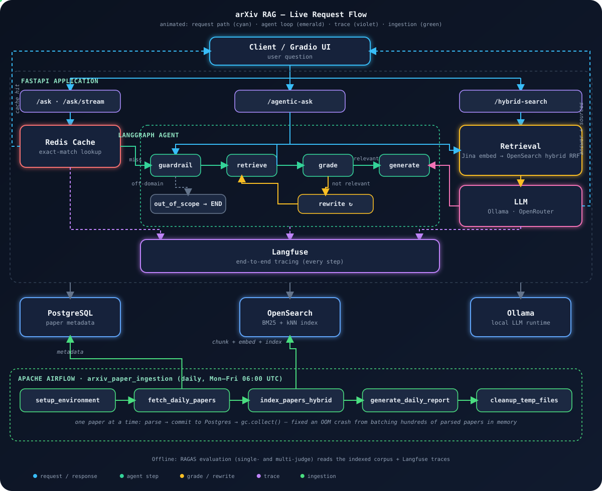

<div align="center">

# 🔎 Production-Grade arXiv RAG System

**An agentic Retrieval-Augmented Generation system over arXiv CS.AI papers** — hybrid search, a multi-provider LLM layer, full LLMOps (tracing, caching, evaluation), and a LangGraph decision agent, built with clean architecture and dependency injection throughout.

[](pyproject.toml)
[](src/main.py)
[](src/services/opensearch)
[](src/services/agents)
[](compose.yaml)
[](License)

> Follows [jamwithai/production-agentic-rag-course](https://github.com/jamwithai/production-agentic-rag-course) as a reference, hardened and extended — see [Improvements Over the Reference Implementation](#-improvements-over-the-reference-implementation).

</div>

---

## 📖 Table of Contents

- [Overview](#overview)
- [Tech Stack](#-tech-stack)
- [Architecture](#-architecture)
- [Key Features](#-key-features)
- [Improvements Over the Reference Implementation](#-improvements-over-the-reference-implementation)
- [Project Structure](#-project-structure)
- [Getting Started](#-getting-started)
- [API Endpoints](#-api-endpoints)
- [Configuration](#-configuration)
- [Make Commands](#-available-make-commands)
- [Evaluation](#-evaluation)
- [Roadmap](#-roadmap)
- [License](#-license)

## Overview

The system ingests papers from arXiv, parses PDFs into structured, section-aware chunks, embeds them, and indexes them into OpenSearch for hybrid retrieval. Queries flow through either a **classic RAG** pipeline or an **agentic** LangGraph workflow that adds a relevance guardrail, document grading, and adaptive query rewriting. Every request is traceable in Langfuse, cacheable in Redis, and measurable with RAGAS.

<div align="center">

| 🧩 Hybrid Search | 🤖 Agentic RAG | 📊 Full LLMOps | ✅ RAGAS Evaluated |
|:---:|:---:|:---:|:---:|
| BM25 + kNN via RRF | Guardrail → Grade → Rewrite | Langfuse + Redis | 4-metric, multi-judge |

</div>

## 🧰 Tech Stack

| Category | Technologies |
|----------|-------------|
| 🚀 **Backend** | FastAPI, Python 3.12, Pydantic v2 |
| 🗄️ **Database** | PostgreSQL 16, SQLAlchemy 2.0 |
| 🔍 **Vector / Search** | OpenSearch 2.19 (BM25 + kNN hybrid via RRF) |
| 🧬 **Embeddings** | Jina Embeddings v3 (1024-dim) |
| 🧠 **LLM (generation)** | Ollama (Llama 3.2, local) or OpenRouter (hosted, any model) |
| 🕸️ **Agent** | LangGraph `StateGraph` |
| 👁️ **Observability** | Langfuse (end-to-end tracing) |
| ⚡ **Cache** | Redis 7 (exact-match response cache) |
| 📏 **Evaluation** | RAGAS (OpenRouter judge + Jina embeddings) |
| 💬 **UI** | Gradio chat interface |
| ⏱️ **Orchestration** | Apache Airflow 3.0 |
| 🐳 **Infrastructure** | Docker Compose, UV package manager |
| 🧪 **Testing** | Pytest, TestContainers |

## 🏗️ Architecture

<div align="center">

</div>

*Live-animated on GitHub: cyan dots trace the request/response path, emerald the agent's step-through, amber the grade → rewrite retry loop, violet the trace spans into Langfuse, and green the Airflow DAG — expanded to its real 5 tasks, with the per-paper streaming-write fix (see [Ingestion Pipeline](#-key-features)) called out directly on the diagram.*

<details>
<summary>View as plain text</summary>

```
                                   Client / Gradio UI
                                          │
                                          ▼
┌──────────────────────────────────────────────────────────────────────────┐
│                            FastAPI Application                             │
│                                                                            │
│  /ask  /ask/stream          /agentic-ask            /hybrid-search         │
│      │                          │                        │                 │
│      ▼                          ▼                        │                 │
│  ┌──────────┐         ┌───────────────────────┐         │                 │
│  │  Redis   │◀────────│   LangGraph Agent      │         │                 │
│  │  cache   │  hit?   │  guardrail → retrieve  │         │                 │
│  └──────────┘         │  → grade → rewrite↺    │         │                 │
│      │ miss           │  → generate            │         │                 │
│      ▼                └───────────────────────┘         │                 │
│  ┌───────────────────────────────────────────────┐     │                 │
│  │  Retrieval: Jina embed → OpenSearch hybrid RRF  │◀────┘                 │
│  └───────────────────────────────────────────────┘                       │
│      │                                                                     │
│      ▼                                                                     │
│  ┌───────────────────────────────┐                                        │
│  │  LLM: Ollama  |  OpenRouter    │   ── every step traced ──▶  Langfuse   │
│  └───────────────────────────────┘                                        │
└──────────────────────────────────────────────────────────────────────────┘
        │                    │                    │
        ▼                    ▼                    ▼
 ┌─────────────┐     ┌─────────────┐      ┌─────────────┐
 │ PostgreSQL  │     │ OpenSearch  │      │   Ollama    │
 │ (metadata)  │     │ (BM25+kNN)  │      │   (LLM)     │
 └─────────────┘     └─────────────┘      └─────────────┘
        ▲                    ▲
        │ metadata           │ chunk + embed + index
┌───────────────────────────────────────────────────────────────────────────┐
│  Apache Airflow · arxiv_paper_ingestion (daily, Mon-Fri 06:00 UTC)        │
│                                                                           │
│  setup_environment → fetch_daily_papers → index_papers_hybrid             │
│    → generate_daily_report → cleanup_temp_files                           │
│                                                                           │
│  one paper at a time: parse → commit to Postgres → gc.collect()           │
│  — fixed an OOM crash from batching hundreds of parsed papers in memory   │
└───────────────────────────────────────────────────────────────────────────┘

 Offline: RAGAS evaluation (single- and multi-judge) reads the corpus + traces.
```

</details>

## ✨ Key Features

<details open>
<summary><b>🔍 Retrieval & RAG</b></summary>
<br>

- **Hybrid search** — BM25 + vector kNN fused with Reciprocal Rank Fusion (`search_unified`), with graceful BM25 fallback if embeddings fail.
- **Section-aware chunking** — overlap-based chunker tuned for academic PDFs.
- **Jina v3 embeddings** — 1024-dim, batched passage + query embedding.
- **Classic RAG** — `POST /api/v1/ask` and token streaming via `POST /api/v1/ask/stream` (SSE).
- **Optimized prompt builder** — compact context construction for smaller local models.

</details>

<details open>
<summary><b>🧠 Multi-Provider LLM Layer</b></summary>
<br>

- **Pluggable providers** — Ollama (local, free) or OpenRouter (hosted, any model) selected via `LLM_PROVIDER`, behind a single interface + factory.
- **Provider-agnostic consumers** — response shapes for both providers are normalized so routers, the agent, and evaluation don't care which is active.

</details>

<details open>
<summary><b>🕸️ Agentic RAG (LangGraph)</b></summary>
<br>

- **Stateful decision graph** — `guardrail → retrieve → grade → (rewrite ↺ | generate)` with an out-of-scope branch.
- **Guardrail node** — scores domain relevance 0–100; off-domain questions skip retrieval entirely.
- **Document grading** — the LLM keeps only relevant chunks before answering.
- **Adaptive query rewriting** — on a failed grade, the query is rewritten and retrieval retried (capped by `AGENT_MAX_RETRIEVAL_ATTEMPTS`).
- **Transparent reasoning trail** — every response includes `reasoning_steps`, `guardrail_score`, `retrieval_attempts`, and `rewritten_query`.
- **Endpoint** — `POST /api/v1/agentic-ask`.

</details>

<details open>
<summary><b>📥 Ingestion Pipeline</b></summary>
<br>

- **Strictly sequential, per-paper processing** — each paper is fully downloaded → parsed → **committed to PostgreSQL** → indexed before the next one starts, instead of parsing a whole batch into memory and writing it out at the end.
- **Why**: with dozens-to-hundreds of papers per run, accumulating parsed PDF content (via Docling) for the whole batch before a single write exhausted memory and crashed the Airflow worker. Committing per paper means progress is durable even if the run is killed mid-way.
- **Aggressive memory cleanup** — the parsed content and downloaded PDF are deleted and `gc.collect()` is forced after every paper (`MetadataFetcher.fetch_and_process_papers`), keeping steady-state memory flat regardless of run size.
- **Airflow DAG** — `arxiv_paper_ingestion` (`setup_environment → fetch_daily_papers → index_papers_hybrid → generate_daily_report → cleanup_temp_files`), scheduled Mon–Fri 06:00 UTC.

</details>

<details open>
<summary><b>📊 LLMOps</b></summary>
<br>

- **Langfuse tracing** — end-to-end spans (embed, retrieve, generate, cache lookup, and each agent node) with token usage. No-op when keys are unset.
- **Redis response cache** — exact-match cache keyed on the normalized question + params; repeated queries skip embedding, search, and generation (**~39 s → ~0.1 s, zero tokens**). No-op when Redis is unset.

</details>

<details open>
<summary><b>✅ Evaluation</b></summary>
<br>

- **RAGAS suite** — faithfulness, answer relevancy, context precision, context recall, judged through any OpenRouter model with Jina embeddings.
- **Multi-model harness** — generate answers once, score them across multiple judge models side-by-side to expose judge-dependent variance.
- **Corpus-grounded dataset** — evaluation questions grounded in the actually-indexed papers, so scores reflect pipeline quality rather than corpus coverage.

</details>

## 🆚 Improvements Over the Reference Implementation

The reference course provides an Ollama-centric pipeline with LangChain-based agent tooling. This implementation hardens it for real-world robustness:

<details>
<summary><b>Show comparison table</b></summary>
<br>

| Area | Reference | This implementation |
|------|-----------|---------------------|
| **LLM provider** | Ollama-focused | Dual provider (Ollama **and** OpenRouter) behind one interface + factory, switchable via env |
| **Agent construction** | LangChain `ToolNode` / `create_retriever_tool` (needs function-calling models) | LangGraph `StateGraph` driven by the existing async `httpx` clients — works with small local models, fewer heavy deps |
| **Failure handling** | — | Every agent node is **fail-open**: guardrail/grade/generate degrade gracefully instead of crashing the graph |
| **Optional infra** | — | Tracer and cache are **no-ops** when Langfuse/Redis aren't configured, so the app never breaks on missing infra |
| **RAGAS judge** | OpenAI direct | Any model via **OpenRouter** + Jina embeddings (reuses existing keys); **judge `max_tokens` capped** to avoid RAGAS's 65k default causing credit `402`s and waste |
| **Evaluation tooling** | Single-run | **Multi-model harness** (generate once, score many) + **corpus-grounded dataset** for meaningful scores |
| **Tracing granularity** | Request-level | Per-step spans incl. **cache hit/miss** and each **agent node** |
| **Redis** | — | Configured as a **pure cache** (persistence off) to avoid disk writes; case/whitespace-insensitive, param-aware key |
| **Ingestion memory profile** | Batch-parse then write | **Per-paper streaming writes** to PostgreSQL + forced `gc.collect()` after each paper — fixes an OOM crash that killed the Airflow worker once runs grew to hundreds of papers |
| **Repo hygiene** | — | Fixed an over-broad `.gitignore` that was excluding all `scripts/` source; verified 2026-valid OpenRouter model IDs |

</details>

## 📁 Project Structure

<details>
<summary><b>Show full tree</b></summary>
<br>

```
src/
├── config.py                  # Pydantic Settings (LLM, embeddings, Langfuse, Redis, agent, RAGAS)
├── main.py                    # FastAPI app + lifespan wiring
├── dependencies.py            # DI definitions (LLM, cache, tracer, agent, ...)
├── gradio_app.py              # Gradio chat UI
│
├── routers/
│   ├── ping.py                # /ping, /health
│   ├── papers.py              # Paper CRUD
│   ├── hybrid_search.py       # /hybrid-search (BM25 + kNN)
│   ├── ask.py                 # /ask, /ask/stream (classic RAG)
│   └── agentic_ask.py         # /agentic-ask (LangGraph agent)
│
├── schemas/                   # Pydantic request/response models
│
└── services/
    ├── arxiv/                 # arXiv API client
    ├── pdf_parser/            # Docling-based PDF parsing
    ├── indexing/              # Section-aware chunker + hybrid indexer
    ├── embeddings/            # Jina embeddings client
    ├── opensearch/            # Hybrid search (BM25 + kNN, RRF)
    ├── llm/                   # Provider-agnostic LLM factory + prompt builder
    ├── ollama/                # Ollama client
    ├── openrouter/            # OpenRouter client
    ├── cache/                 # Redis exact-match response cache (RAGCache)
    ├── observability/         # Langfuse tracer (RAGTracer, no-op fallback)
    └── agents/                # Agentic RAG (LangGraph)
        ├── agentic_rag.py     # AgenticRAGService: builds + runs the StateGraph
        ├── state.py           # AgentState (with reasoning-steps reducer)
        ├── config.py          # GraphConfig (thresholds, attempts, top_k)
        ├── context.py         # Shared clients + normalized LLM/retrieval helpers
        ├── prompts.py         # Guardrail / grade / rewrite / out-of-scope prompts
        └── nodes/             # guardrail, retrieve, grade, rewrite, generate, out_of_scope

scripts/
├── manual_ingest.py           # Manual paper ingestion
├── test_ask.py                # CLI to exercise /ask + /stream
├── eval_ragas.py               # RAGAS evaluation (single judge)
├── eval_multi_model.py        # RAGAS across multiple judge models
└── eval_dataset.json          # Corpus-grounded eval questions + ground truth

airflow/
└── dags/                      # arXiv ingestion pipeline
```

</details>

## 🚀 Getting Started

### Prerequisites
- Docker & Docker Compose
- Python 3.12+
- [UV package manager](https://github.com/astral-sh/uv)

### Quick Start

```bash
git clone <your-repo-url>
cd prod-grade-rag-system

# copy and fill env (JINA_API_KEY required for hybrid search)
cp .env.example .env   # if provided; otherwise create .env (see Configuration)

make start     # build + start all services
make health    # verify service health

# ingest some papers, then query
uv run python scripts/manual_ingest.py
```

### Service URLs

| Service | URL | Notes |
|---------|-----|-------|
| 🚀 **RAG API** | http://localhost:8000 | FastAPI |
| 📚 **API Docs** | http://localhost:8000/docs | Swagger UI |
| 💬 **Gradio Chat UI** | http://localhost:7861 | `make gradio` |
| 🔍 **OpenSearch** | http://localhost:9200 | Search engine |
| 📊 **OpenSearch Dashboards** | http://localhost:5601 | Visualization |
| ⏱️ **Airflow** | http://localhost:8080 | admin / admin |
| 🧠 **Ollama** | http://localhost:11434 | Local LLM |
| ⚡ **Redis** | localhost:6379 | Response cache |
| 👁️ **Langfuse** | https://us.cloud.langfuse.com | Managed tracing (set keys) |

## 🔌 API Endpoints

All endpoints are prefixed with `/api/v1`.

<details open>
<summary><b>Classic RAG</b></summary>
<br>

```bash
POST /api/v1/ask
{ "question": "What is transformer attention?", "top_k": 5, "use_hybrid": true }

POST /api/v1/ask/stream     # same body, Server-Sent Events token stream
```

</details>

<details open>
<summary><b>Agentic RAG</b></summary>
<br>

```bash
POST /api/v1/agentic-ask
{ "question": "How do multi-agent LLM systems detect malicious behavior?", "top_k": 3 }
```

Response includes the answer plus the agent's decision trail:

```json
{
  "answer": "...",
  "sources": ["https://arxiv.org/pdf/2607.06807.pdf"],
  "chunks_used": 3,
  "search_mode": "hybrid",
  "guardrail_score": 64,
  "retrieval_attempts": 1,
  "rewritten_query": null,
  "reasoning_steps": [
    "Guardrail scored domain relevance 64/100 -> in_scope",
    "Retrieved 3 chunks (hybrid, attempt 1)",
    "Graded chunks: 3/3 relevant",
    "Generated answer from 3 chunk(s)"
  ]
}
```

</details>

<details>
<summary><b>Hybrid Search</b></summary>
<br>

```bash
POST /api/v1/hybrid-search/
{ "query": "transformer attention mechanism", "size": 5, "use_hybrid": true }
```

</details>

<details>
<summary><b>Health</b></summary>
<br>

```bash
GET /api/v1/ping      # {"status": "ok", "message": "pong"}
GET /api/v1/health    # service + dependency health
```

</details>

## ⚙️ Configuration

Environment variables are managed via Pydantic Settings (`src/config.py`). Optional integrations degrade gracefully when unset.

<details open>
<summary><b>Show all environment variables</b></summary>
<br>

| Variable | Default | Description |
|----------|---------|-------------|
| `POSTGRES_DATABASE_URL` | `postgresql+psycopg2://...` | Database connection |
| `OPENSEARCH__HOST` | `http://opensearch:9200` | OpenSearch endpoint |
| `LLM_PROVIDER` | `ollama` | `ollama` or `openrouter` |
| `OLLAMA_HOST` / `OLLAMA_MODEL` | `http://ollama:11434` / `llama3.2` | Local LLM |
| `OPENROUTER_API_KEY` / `OPENROUTER_MODEL` | – / `meta-llama/llama-3.2-3b-instruct` | Hosted LLM |
| `JINA_API_KEY` | – | Required for embeddings / hybrid search |
| `REDIS_URL` | – (disabled) | Response cache; container uses `redis://redis:6379/0` |
| `CACHE_TTL_SECONDS` | `3600` | Cache entry TTL |
| `LANGFUSE_PUBLIC_KEY` / `LANGFUSE_SECRET_KEY` | – (disabled) | Enable tracing (both required) |
| `LANGFUSE_HOST` | `https://us.cloud.langfuse.com` | Langfuse endpoint |
| `RAGAS_JUDGE_MODEL` | `openai/gpt-4o-mini` | RAGAS judge (any OpenRouter model) |
| `RAGAS_EMBEDDING_MODEL` | `jina-embeddings-v3` | RAGAS embeddings |
| `AGENT_TOP_K` | `5` | Agent retrieval size |
| `AGENT_MAX_RETRIEVAL_ATTEMPTS` | `2` | Max rewrite + retry passes |
| `AGENT_GUARDRAIL_THRESHOLD` | `50` | 0–100 in-scope cutoff |
| `AGENT_GRADE_MIN_RELEVANT` | `1` | Min relevant chunks to answer |

</details>

## 🛠️ Available Make Commands

<details open>
<summary><b>Show all commands</b></summary>
<br>

```bash
make start        # Build + start all services
make stop         # Stop all services
make health       # Check all services health
make logs         # Tail service logs
make gradio       # Start Gradio chat UI (Docker, :7861)
make gradio-local # Launch Gradio locally (dev)
make test-ask     # Exercise the /ask endpoint
make eval-ragas   # RAGAS evaluation (single judge)
make eval-multi   # RAGAS across multiple judge models
make format       # Ruff format
make lint         # Ruff check + mypy
make test         # Pytest
make test-cov     # Pytest with coverage
make clean        # Tear down + prune
```

</details>

## 📏 Evaluation

```bash
# Single-judge RAGAS run (writes scripts/ragas_results.json)
make eval-ragas

# Compare judges side-by-side (writes scripts/ragas_multi_model_results.json)
make eval-multi
uv run python scripts/eval_multi_model.py \
  --judge-models openai/gpt-4o-mini,google/gemini-2.5-flash,anthropic/claude-sonnet-5
```

The multi-model harness generates pipeline answers once and scores them with each judge, surfacing how much a "quality" score depends on the grader (e.g. faithfulness varying from ~0.92 with `gpt-4o-mini` to ~0.56 with a stricter judge), while retrieval metrics stay judge-independent.

### Development

```bash
uv sync                                            # install deps
uv run uvicorn src.main:app --reload --port 8000   # run locally (services must be up)
make format && make lint                           # code quality
```

## 🗺️ Roadmap

- [x] **Week 1** — FastAPI + PostgreSQL, health checks, CRUD
- [x] **Week 2** — PDF parsing with Docling
- [x] **Week 3** — Airflow arXiv ingestion pipeline
- [x] **Week 4** — OpenSearch hybrid search (BM25 + kNN) + Jina embeddings
- [x] **Week 5** — RAG pipeline: multi-provider LLM, streaming, prompt builder, Gradio UI
- [x] **Week 6** — LLMOps: Langfuse tracing, Redis cache, RAGAS + multi-model evaluation
- [x] **Week 7** — Agentic RAG with LangGraph (guardrail, grading, query rewriting)
- [ ] Optional: Telegram bot interface
- [ ] Production deployment (Kubernetes)

## 📄 License

MIT License — see [LICENSE](License) for details.

---

<div align="center">

Built with modern Python practices for production-grade, agentic RAG.

[⬆ Back to top](#-production-grade-arxiv-rag-system)

</div>
